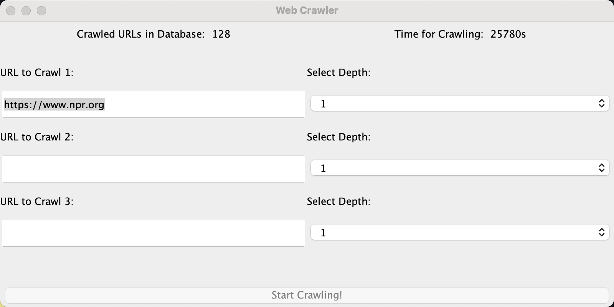
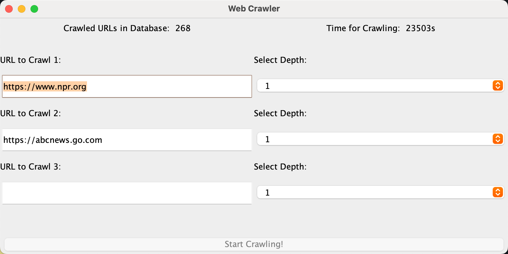

## Introduction

This is a multithreaded web crawler implemented in Java. The techniques includes Thread, JDBC, Swing and Jsoup.

OS: MacOS 2.6 GHz 6-Core Intel Core i7

## Dependencies

### Java JAR packages
- Jsoup: [jsoup-1.17.1.jar](https://jsoup.org/download)
- JDBC: [mysql-connector-j-8.2.0.jar](https://dev.mysql.com/downloads/connector/j/?os=26)

## Database Setup
The database I used is MySQL. To run my code, first you need to replace your database username and password in `CrawlerGUI.java`.
```java
// CrawlerGUI.java
public class CrawlerGUI extends JFrame{
    private static final String DB_USER = "myuser";
    private static final String DB_PASSWORD = "535897";

    ...
```
Then you need to create a database called  `webcrawler`. First, open your terminal to start MySQL:
```bash
mysql -u [username] -p
```
Under SQL mode, create database `webcrawler`:
```sql
create database webcrawler;
```
## Result
You can build at most three crawlers simultaneously. Each crawler needs a starting URL. You can customize the maximum depth (options are 1 to 5) on each crawler. Below is the result of crawling NPR website with 1 maximum depth. You can see number of URLs stored in our database currently on the top left screen.



Continuing crawling another URL, you'll see current URLs are 268 in total.



Note, when you restart the program, database will be cleared. Therefore, every time you start a new UI, you will find the crawled URLs in database is 0.
